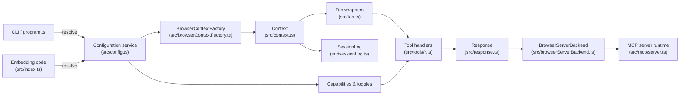

# MCP Accessibility Scanner – Implementation Guide

## Project Overview
The MCP Accessibility Scanner packages a Model Context Protocol (MCP) server that combines Playwright-driven browsing with Axe-core auditing so automations or large language models can inspect live web content for accessibility violations and capture reproducible interaction traces. The published package exposes both a reusable programmatic factory (`createConnection`) and a CLI entry point (`mcp-server-playwright`) that boot the same backend with different transports.

## Architecture & Design

### Directory structure and organization
- `src/index.ts` – Entry point for embedders; resolves configuration, chooses a browser context factory, and returns an MCP server configured with `BrowserServerBackend`.
- `src/program.ts` – Commander-powered CLI that parses flags, resolves configuration, and launches the backend in standalone, extension, VS Code, or proxy modes.
- `src/browserServerBackend.ts` – Implements the MCP `ServerBackend` contract, filters tools by capability, instantiates `Context`, and serializes responses and session logs.
- `src/browserContextFactory.ts` – Chooses persistent, isolated, CDP, or remote browser context implementations and manages tracing directories and cleanup.
- `src/context.ts` – Coordinates browser context lifecycle, tab tracking, network interception, recorder integration, and exposes helpers such as `ensureTab`, `outputFile`, and modal state handling.
- `src/tab.ts` – Wraps a Playwright `Page`, surfaces ARIA snapshot helpers, modal state tracking, download persistence, and locator utilities for tools.
- `src/response.ts` – Aggregates result text, code snippets, optional images, and tab metadata before serializing them into MCP payloads.
- `src/sessionLog.ts` – Persists chronological Markdown/YAML logs of tool calls, user actions, and snapshots when session logging is enabled.
- `src/tools.ts` & `src/tools/` – Registers all tool modules (navigation, mouse, keyboard, snapshot, verify, etc.) and filters them by capability flags.
- `src/mcp/`, `src/extension/`, and `src/vscode/` – Provide transport adapters, extension bridges, and VS Code integration helpers without changing tool logic.
- `config.d.ts`, `index.d.ts`, `cli.js`, and `index.js` – Generated or compiled artifacts that surface the TypeScript API and CLI for consumers.

### Core modules and their responsibilities
- **Configuration service (`src/config.ts`)** – Merges defaults, config files, environment variables, and CLI flags into a `FullConfig` that controls browser launch options, network allow/block lists, timeout defaults, image attachment rules, capabilities, and artifact directories.
- **Server backend (`src/browserServerBackend.ts`)** – Initializes the `Context` and optional `SessionLog`, filters the tool catalog, and standardizes request parsing, handler invocation, and response finalization.
- **Browser context factory (`src/browserContextFactory.ts`)** – Implements persistent, isolated, CDP, and remote strategies that acquire browsers, configure tracing, manage user data directories, and tear down contexts safely.
- **Context orchestration (`src/context.ts`)** – Lazily provisions browser contexts, applies network interception, wires the Playwright recorder for session logging, tracks open tabs, and exposes tab management and artifact helpers.
- **Tab runtime (`src/tab.ts`)** – Maintains per-tab state such as modal dialogs, console logs, downloads, and ARIA snapshots; provides reference-based locator helpers and completion barriers for tooling.
- **Response assembly (`src/response.ts`)** – Collects human-readable results, Playwright code snippets, modal state summaries, and optional tab snapshots/images before emitting MCP-compliant content.
- **Session logging (`src/sessionLog.ts`)** – Streams tool responses and recorder events into Markdown while storing ARIA snapshots as YAML artifacts for offline auditing.
- **Tool execution pipeline (`src/tools/*.ts`)** – Uses `defineTool`/`defineTabTool` abstractions to declare Zod-validated schemas, capability tags, and modal state semantics for each command exposed to MCP clients.

### Data flow between modules
1. An embedder (`createConnection`) or CLI invocation (`src/program.ts`) resolves the merged `FullConfig`, builds a `BrowserContextFactory`, and instantiates `BrowserServerBackend` registered with the MCP server runtime.
2. During MCP initialization, the backend optionally creates a `SessionLog`, constructs a `Context` with client metadata, and primes the capability-filtered tool list.
3. The first tool call triggers `Context` to lazily create a Playwright browser context using the selected factory, apply network interception rules, attach recorder hooks when logging is enabled, and register tab lifecycle listeners.
4. Tool handlers execute with either the shared `Context` or the current `Tab`, leveraging reference-based locators, modal state guards, and completion helpers to perform navigation, interaction, scanning, or verification.
5. After handler completion, `Response.finish` captures updated tab metadata, attaches modal state summaries or ARIA snapshots, and (when enabled) `SessionLog` writes Markdown entries with associated YAML snapshots.
6. When the MCP server shuts down or tabs close, `Context` stops tracing, flushes downloads, and disposes browser contexts via the active factory to release resources and user data locks.

## Feature Documentation

### Feature A – Automated Accessibility Auditing (`scan_page`)
- **Purpose** – Runs Axe-core against the active page to enumerate violations, incomplete checks, passes, and inapplicable rules so that accessibility regressions can be triaged programmatically.
- **Integration** – Implemented as a core capability tool that resolves the active tab via `Context.currentTabOrDie()`, instantiates an Axe builder bound to the tab’s Playwright page, and streams summarized results and violation details into the shared `Response` pipeline.
- **Types & interfaces**
  ```ts
  const scanPageSchema = z.object({
    violationsTag: z.array(z.enum(tagValues))
      .min(1)
      .default([...tagValues])
      .describe('Array of tags to filter violations by. If not specified, all violations are returned.')
  });
  ```
- **Configuration & toggles** – Availability is gated by the tool’s `capability: 'core'`, so it is always exposed unless a client disables core tools. CLI or config options such as `imageResponses`, network allow/block lists, and timeout overrides influence how snapshots, requests, and waits behave while scanning.

### Feature B – Snapshot-driven Browser Interactions (`browser_snapshot`, `browser_click`, `browser_drag`, `browser_hover`)
- **Purpose** – Uses Playwright’s ARIA snapshot references to ground interactions in deterministic locators, enabling LLMs to operate on explicit element IDs instead of inferred selectors.
- **Integration** – Declared through `defineTabTool` so each command enforces modal-state compatibility, pulls locators from `Tab.refLocator(s)`, executes the Playwright action inside `Tab.waitForCompletion`, and records runnable code snippets plus optional snapshots in the shared `Response`.
- **Types & interfaces**
  ```ts
  export const elementSchema = z.object({
    element: z.string().describe('Human-readable element description used to obtain permission to interact with the element'),
    ref: z.string().describe('Exact target element reference from the page snapshot'),
  });
  ```
- **Configuration & toggles** – Core capability tools obey global toggles such as `config.timeouts` (interaction deadlines), `saveTrace`/`saveSession` (artifact capture), `imageResponses` (response attachments), and network filtering rules configured in `src/config.ts`.

## Getting Started

### Installation and setup
```bash
npm install -g mcp-accessibility-scanner
# or run without global install
npx mcp-accessibility-scanner
```

For local development:
```bash
git clone https://github.com/JustasMonkev/mcp-accessibility-scanner.git
cd mcp-accessibility-scanner
npm install
```

### Running the project locally
```bash
npx mcp-accessibility-scanner [options]
```
Key flags include `--browser`, `--caps`, `--extension`, `--vscode`, `--cdp-endpoint`, `--user-data-dir`, `--save-session`, `--save-trace`, and networking/timeouts switches exposed in the CLI.

### Building for production
```bash
npm run build
```
The build script compiles TypeScript sources to JavaScript in `lib/`, while `npm run lint`, `npm run watch`, and `npm run clean` support verification, incremental builds, and artifact cleanup.

## API Reference

### `createConnection(userConfig?: Config, contextGetter?: () => Promise<BrowserContext>): Promise<Server>`
Resolves configuration, selects an appropriate `BrowserContextFactory`, and returns an MCP server instance configured with `BrowserServerBackend` for embedding inside custom hosts.

### `BrowserServerBackend`
Implements the MCP backend contract: filters tools by capability, initializes `Context`/`SessionLog`, parses inputs with Zod schemas, invokes tool handlers, captures results, and serializes responses for transport adapters.

### `Context`
Coordinates browser context provisioning, tab lifecycle, network interception, recorder integration, and resource cleanup. Provides helpers such as `ensureTab`, `newTab`, `closeBrowserContext`, `outputFile`, and modal state accessors for tools.

### `Tab`
Encapsulates a Playwright page, collecting console messages, downloads, modal state transitions, and ARIA snapshots. Supplies `refLocator`, `refLocators`, `waitForCompletion`, `captureSnapshot`, and modal state rendering helpers.

### `Response`
Aggregates result text, code blocks, tab lists, modal state notes, optional ARIA snapshots, and image attachments. `finish()` captures post-action state and `serialize()` emits MCP-compliant content.

### `SessionLog`
Creates timestamped session folders, appends Markdown entries for tool runs and user actions, and writes ARIA snapshots as YAML files when session logging is enabled.

### `BrowserContextFactory` strategies
Persistent, isolated, CDP, and remote factories acquire browsers with tracing directories, manage user-data directories, and close contexts/browsers safely. Extension and VS Code factories adapt the same interface for external connections.

### MCP transport helpers
`src/mcp/server.ts`, `proxyBackend`, and VS Code adapters provide stdio/HTTP transports, multiplexing, and extension bridges without modifying core tool logic.

## System Diagram


## Best Practices & Guidelines
- Use `defineTool`/`defineTabTool` when adding new commands so schemas, capability tags, and modal state semantics remain consistent.
- Respect capability gating (`core` vs opt-in flags) when exposing new tooling to maintain backward compatibility with existing MCP clients.
- Leverage `Tab.refLocator`, `waitForCompletion`, and ARIA snapshot references instead of ad-hoc selectors to keep interactions reproducible.
- Populate `Response` with both human-readable summaries and Playwright code snippets so automated consumers can replay actions and audits.
- Honor configuration flags such as `saveTrace`, `saveSession`, `imageResponses`, and network allow/block lists to avoid unexpected artifacts or network access.
- Ensure new context factories and integrations implement proper cleanup (`close`) so `Context.closeBrowserContext()` can stop tracing and release resources.
- Extend configuration via `mergeConfig` patterns to preserve defaults and allow CLI/environment overrides to remain additive.
